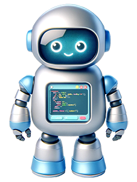

<h1>Robotuko pasauliai</h1>

Kažkur, toli, toli, vienoje žinomoje planetoje gyvena paprastas robotukas. Jo vardas toks pat paprastas - Robotukas. Jis yra sugedęs, todėl, kai eina - iš jo varva alyva. Taip matosi visas robotuko kelias. Kadangi robotukas paprastas - jis žino tik kelias komandas. Robotukas būtų pasmerktas, tačiau jis supranta Pitoną ir jam labai pasisekė, kad sutiko Jus! Jūs jam padėsite suprogramuoti visas komandas, kurių trūksta kasdieniams darbams atlikti. Taip Robotukas galės padėti savo draugams ir gyventi pilnavertį gyvenimą!

 

<h2>Apie projektą</h2>

Šį projektą dariau laisvalaikiu, nes mane sužavėjo Robotuko pasaulio idėja ir jį buvo be galo smagu kurti. Tikiuosi, kad jums bus taip pat smagu jį žaisti!

Jei kur užkliuvote, turite gerų idėjų ar tiesiog norite pabendrauti su bendraminčiais, kviečiu prisijungti prie Discord serverio. Pakvietimo nuoroda: <a href="https://discord.gg/skzFC8KtQ2">https://discord.gg/skzFC8KtQ2</a>

<h2>Padėka</h2>

Robotuko aplinką pavadinimu <a href="http://reeborg.ca/" target="_blank">Reeborg World</a> sukūrė André Roberge, o aš (Tomas Blažauskas) adaptavau ją lietuvių kalbai ir pridėjau keletą korekcijų. Pamokėles, kurias mėginsite įveikti, sukūrė Dan Schellenberg. Jo kursą adaptavau lietuvių kalbai. Originalus kursas, kartu su kitomis papildomomis pamokėlėmis yra čia: <a href="https://cs20.ca/" target="_blank">https://cs20.ca/</a>. Šį kursą autorius teikia Creative Commons licencija, kas suteikė galimybes jį padaryti lietuvių kalba.

Taip pat noriu padėkoti Lietuvos informatikos mokytojų ir dėstytojų bendruomenei, kuri palaiko šį ir daugelį kitų darbų :) Man tai labai svarbu!

Sukurta Dan Schellenberg, adaptuota Tomo Blažausko.  <a rel="license" href="http://creativecommons.org/licenses/by-sa/4.0/">Creative Commons Attribution-ShareAlike 4.0 International License</a>.
    
